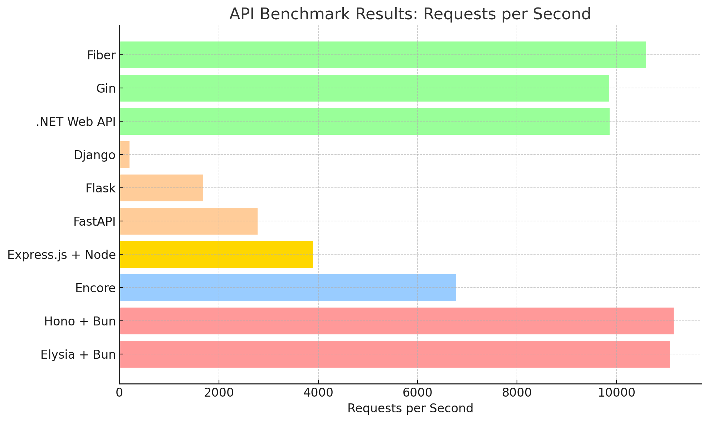

# encore-hono-express-api-benchmark

This repository contains benchmark results comparing the performance of several web frameworks and APIs, including Encore, Hono, Express.js, FastAPI, Flask, Django, and others.

## Frameworks Benchmarked

The following frameworks and environments were tested for performance, measured by requests per second, time per request, and data transfer rate:

- **Elysia + Bun**
- **Encore**
- **Express.js + Node.js**
- **Hono + Bun**
- **FastAPI (Uvicorn)**
- **Flask**
- **Django**
- **.NET Web API (Minimal API)**
- **Gin (Go)**
- **Fiber (Go)**

---

## Benchmark Results

| Framework             | Requests per second | Time per request (ms) | Transfer rate (Kbytes/sec) |
|-----------------------|---------------------|-----------------------|----------------------------|
| **Hono + Bun**        |           11,148.36 |                 8.970 |                   1,622.17 |
| **Elysia + Bun**      |           11,077.71 |                 9.027 |                   1,601.08 |
| **Fiber**             |           10,595.88 |                 9.438 |                   1,583.17 |
| **.NET Web API**      |            9,863.87 |                10.138 |                   1,599.03 |
| **Gin**               |            9,854.33 |                10.148 |                   1,433.88 |
| **Encore**            |            6,774.42 |                14.761 |                   2,500.71 |
| **Express.js + Node** |            3,895.86 |                25.668 |                     886.46 |
| **FastAPI**           |            2,777.45 |                36.004 |                     458.39 |
| **Flask**             |            1,686.76 |                59.285 |                     316.27 |
| **Django**            |              202.04 |               494.948 |                      57.61 |

---

## Summary

- **Hono + Bun** and **Elysia + Bun** demonstrated the highest requests per second, with minimal response times.
- **Encore** achieved a high data transfer rate, showing strong performance.
- **.NET Web API**, **Fiber**, and **Gin** offered excellent throughput and low latency.
- **FastAPI**, **Flask**, and **Django** performed significantly slower, particularly Django with the highest latency.

---

## License

This project is licensed under the MIT License. See the [LICENSE](LICENSE) file for more details.
